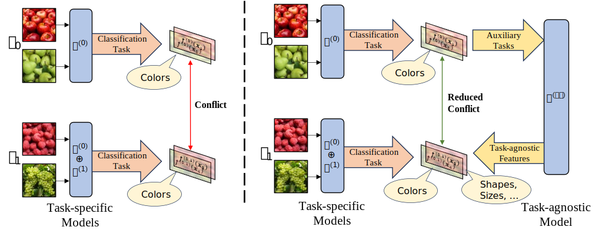
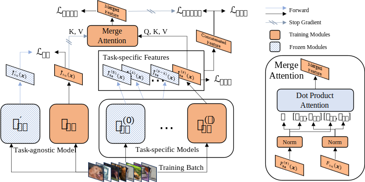

# Task-Agnostic Guided Feature Expansion for Class-Incremental Learning

This is the code repo for Task-Agnostic Guided Feature Expansion for Class-Incremental Learning (CVPR 2025).

TL;DR: We propose **TagFex** framework to address _feature collision_ in Class-Incremental Learning. TagFex features in continuously capturing task-agnostic features through a separate unsupervised model. TagFex achieves superior performance by a large margin, comparing to other expansion-based methods training models from scratch.

[[arxiv]]()





## To Run the Code

Package Requirements

```
pytorch torchvision torchmetrics loguru tqdm
```

Single-node training (for small datasets like CIFAR100)

``` bash
CUDA_VISIBLE_DEVICES={gpu_ids} python main.py train --exp-configs {exp_config_files}
```

Multi-node training (for large datasets like ImageNet)

``` bash
./trainddp.sh {gpu_ids} --exp-configs {exp_config_files}
```

Specify cuda device available in `{gpu_ids}`.
Specify config files in `{exp_config_files}`, this argument accepts multiple values, the loading order is the same as the argument order. (see [`load_configs` function](utils/configuration.py#11))

Example:

``` bash
python main.py train --exp-configs configs/all_in_one/cifar100_10-10_tagfex_resnet32.yaml --log-dir ./logs/exp_cifar100_10-10
./trainddp.sh 0,1,2,3 --exp-configs configs/all_in_one/cifar100_10-10_tagfex_resnet32.yaml --log-dir ./logs/exp_cifar100_10-10
```

Other useful arguments:

``` bash
--exp-name # name the experiment
--log-dir # the folder to output log files
--ckpt-dir # the folder to checkpoint
--output-file-prefix # the filename prefix of output file
```

For more arguments, see [`argument.py`](utils/argument.py).

## Acknowledgements

This repository is inspired by [PyCIL](https://github.com/G-U-N/PyCIL).
